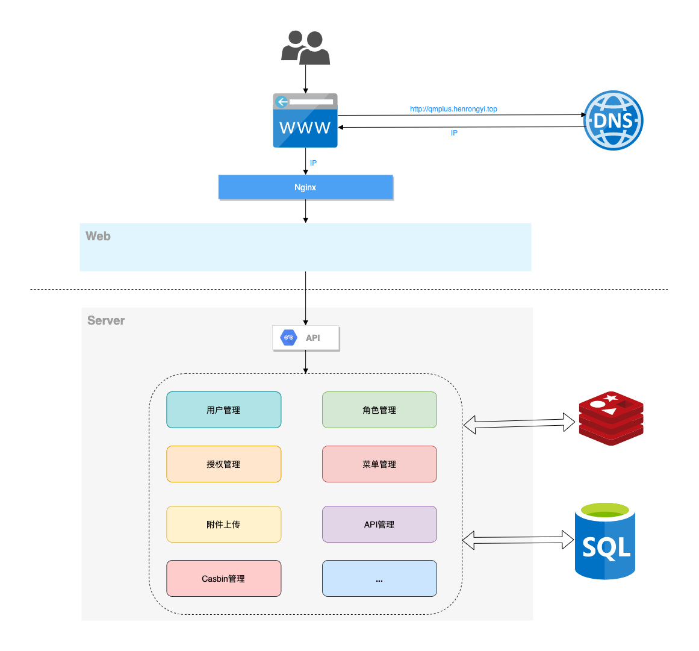

<div align=center>
</div>
<div align=center>


</div>

# 项目文档

- 前端UI框架：[element-ui](https://github.com/ElemeFE/element) 
- 后台框架：[gin](https://github.com/gin-gonic/gin) 

## 1. 基本介绍

### 1.1 项目介绍

> opsadmin 是一个基于Gin-vue-admin开发的全栈前后端分离的后台管理系统，主要用于静态文件项目（php,  html, nodejs），项目提测，发布，快速更新迭代升级

### 1.3 版本列表


## 2. 使用说明

```
- node版本 > v8.6.0
- golang版本 >= v1.11
- IDE推荐：Goland
- 各位在clone项目以后，把db文件导入自己创建的库后，最好前往七牛云申请自己的空间地址。
- 替换掉项目中的七牛云公钥，私钥，仓名和默认url地址，以免发生测试文件数据错乱
```

### 2.1 web端

```bash
# clone the project
git clone https://github.com/tridentss/opsadmin.git

# enter the project directory
cd web

# install dependency
npm install

# develop
npm run serve
```

### 2.2 server端

```bash
# 使用 go.mod

# 安装go依赖包
go list (go mod tidy)

# 编译
go build
```

### 2.3 swagger自动化API文档

#### 2.3.1 安装 swagger

##### （1）可以翻墙
````
go get -u github.com/swaggo/swag/cmd/swag
````

##### （2）无法翻墙
由于国内没法安装 go.org/x 包下面的东西，需要先安装`gopm`

```bash
# 下载gopm包
go get -v -u github.com/gpmgo/gopm

# 执行
gopm get -g -v github.com/swaggo/swag/cmd/swag

# 到GOPATH的/src/github.com/swaggo/swag/cmd/swag路径下执行
go install
```

#### 2.3.2 生成API文档

````
cd server
swag init
````
执行上面的命令后，server目录下会出现docs文件夹，登录http://localhost:8888/swagger/index.html，即可查看swagger文档


## 3. 技术选型

- 前端：用基于`vue`的`Element-UI`构建基础页面。
- 后端：用`Gin`快速搭建基础restful风格API，`Gin`是一个go语言编写的Web框架。
- 数据库：采用`MySql`(5.6.44)版本，使用`gorm`实现对数据库的基本操作,已添加对sqlite数据库的支持。
- 缓存：使用`Redis`实现记录当前活跃用户的`jwt`令牌并实现多点登录限制。
- API文档：使用`Swagger`构建自动化文档。
- 配置文件：使用`fsnotify`和`viper`实现`yaml`格式的配置文件。
- 日志：使用`go-logging`实现日志记录。


## 4. 项目架构
### 4.1 系统架构图



### 4.3 目录结构

```
    ├─server  	     （后端文件夹）
    │  ├─api            （API）
    │  ├─config         （配置包）
    │  ├─core  	        （內核）
    │  ├─db             （数据库脚本）
    │  ├─docs  	        （swagger文档目录）
    │  ├─global         （全局对象）
    │  ├─initialiaze    （初始化）
    │  ├─middleware     （中间件）
    │  ├─model          （结构体层）
    │  ├─resource       （资源）
    │  ├─router         （路由）
    │  ├─service         (服务)
    │  └─utils	        （公共功能）
    └─web            （前端文件）
        ├─public        （发布模板）
        └─src           （源码包）
            ├─api       （向后台发送ajax的封装层）
            ├─assets	（静态文件）
            ├─components（组件）
            ├─router	（前端路由）
            ├─store     （vuex 状态管理仓）
            ├─style     （通用样式文件）
            ├─utils     （前端工具库）
            └─view      （前端页面）

```

## 5. 主要功能

- 权限管理：基于`jwt`和`casbin`实现的权限管理 
- 文件上传下载：实现基于七牛云的文件上传操作（为了方便大家测试，我公开了自己的七牛测试号的各种重要token，恳请大家不要乱传东西）
- 分页封装：前端使用mixins封装分页，分页方法调用mixins即可 
- 用户管理：系统管理员分配用户角色和角色权限。
- 角色管理：创建权限控制的主要对象，可以给角色分配不同api权限和菜单权限。
- 菜单管理：实现用户动态菜单配置，实现不同角色不同菜单。
- api管理：不同用户可调用的api接口的权限不同。
- 配置管理：配置文件可前台修改（测试环境不开放此功能）。
- 资源管理：管理环境，主机
- 发布系统：生产项目管理，项目提测，项目上线，项目回滚 
```
前端文件参考: src\view\superAdmin\api\api.vue 
后台文件参考: model\dnModel\api.go 


## 6. 联系方式
### 6.1 技术群
| QQ群 |  
|  :---:  |
||65355077|

### 6.2 项目组成员
   eagle

## 7.教学视频

（1）环境搭建
> Bilibili：https://www.bilibili.com/video/BV1Fg4y187Bw/ (v1.0版本视频，v2.0操作相同目录不同)
    
（2）模板使用
> Bilibili：https://www.bilibili.com/video/BV16K4y1r7BD/ (v1.0版本视频，v2.0操作相同目录不同)

（3）2.0目录以及开发体验
> Bilibili：https://www.bilibili.com/video/BV1aV411d7Gm#reply2831798461

（4）golang基础教学视频录制中...
> https://space.bilibili.com/322210472/channel/detail?cid=108884


## 8. 商用注意事项

如果您将此项目用于商业用途，请遵守Apache2.0协议并保留作者技术支持声明。